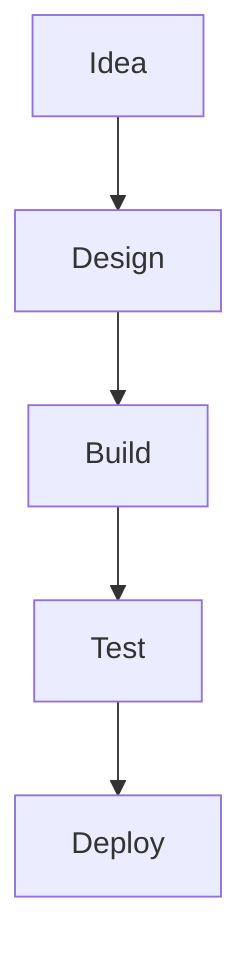

# GenAIFundamentals
Welcome to **GenAIFundamentals**!  
Explore hands-on projects to master Generative AI and build innovative applications.

---


## 🚀 What’s Inside?

- **Mini Projects:** Step-by-step guides to build GenAI-powered apps.
- **Concepts Explained:** Clear explanations of core GenAI principles.
- **Code Samples:** Ready-to-use code snippets in Python and JavaScript.
- **Visual Workflows:** Diagrams and flowcharts for better understanding.

---

## 🧭 Project Flow



---

## 🌟 Highlights

- **Text Generation:** Build chatbots and creative writing tools.
- **Image Generation:** Create art and visuals with AI.
- **Prompt Engineering:** Learn to craft effective prompts.
- **API Integration:** Connect to popular GenAI APIs.

---

## 📸 Gallery

| Project            | Preview                                  |
|--------------------|------------------------------------------|
| Chatbot            |  |
| Image Generator    |   |
| Prompt Playground  |  |

---

## 📝 How to Use

1. **Clone the repo:**  
   ```bash
   git clone https://github.com/yourusername/GenAIFundamentals.git
   ```
2. **Pick a project folder.**
3. **Follow the README in each project.**
4. **Experiment, learn, and have fun!**

---

> _“The best way to learn AI is to build with it.”_

---

**Happy Learning!**  
*— The GenAIFundamentals Team*
